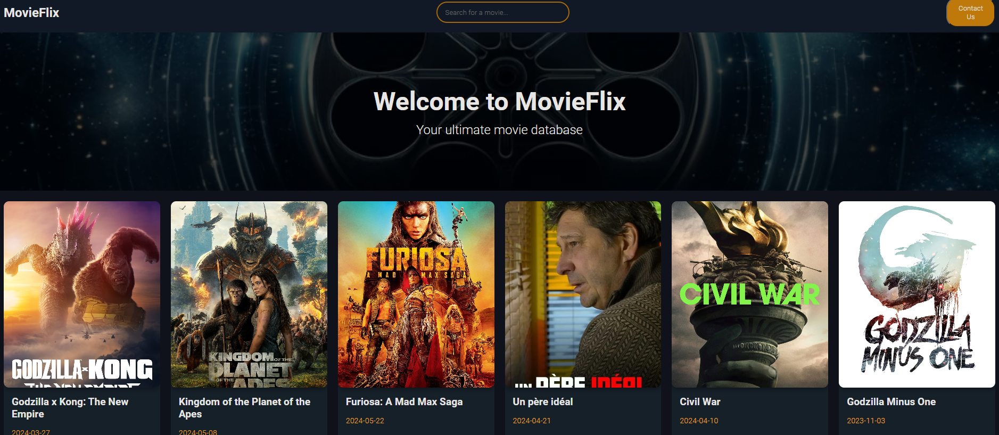

# MovieFlix

Welcome to MovieFlix, your ultimate movie database. Explore popular movies, search for your favorites, and get detailed information about each movie, including cast and summaries.

## Live Site

You can view the live site at [MovieFlix](https://git-with-rohit.github.io/movie-database-site/).

## Features

- Discover popular movies
- Search for movies
- View detailed movie information including cast and summaries
- Responsive design

## Screenshot



## Getting Started

To clone and run this project locally, follow these steps:

### Prerequisites

- Node.js (https://nodejs.org/)
- npm (comes with Node.js)

### Installation

1. Clone the repository

    ```bash
    git clone https://github.com/git-with-Rohit/movie-database-site.git
    cd movie-database-site
    ```
2. **Install dependencies:**
    ```bash
    npm install
    ```

3. **Start the development server:***
    ```bash
    npm start
    ```

## Usage
- Open your browser and navigate to http://localhost:3000.
- Use the search bar to find movies.
- Click on any movie card to view more details about the movie.
- Click on "Contact Us" to view contact information in a modal.

## Technologies Used
- React
- TypeScript
- CSS
- GitHub Pages

Happy browsing!

Rohit Kumar  
[GitHub](https://github.com/git-with-Rohit) | [LinkedIn](https://www.linkedin.com/in/itz-rohit/)
